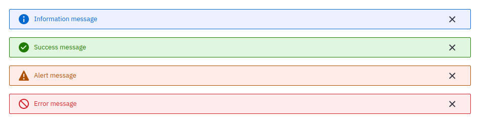

## 1. Regras

- Os alertas devem desaparecer após 6 segundos.
- O sistema possui quatro tipo de alertas Sucesso, Erro, Informação e Atenção conforme mostra a imagem abaixo:

 _Exemplo de tipo de alertas_

## 2. Mensagens

Aqui são descritas as mensagens apresentadas em forma de alerta, a especificação do tipo do alerta está descrita no seu módulo.

<h5 id="email-sem-acesso">E-mail sem acesso</h5>
    "Você não possui acesso ao Meu Bridge com este endereço de email.
