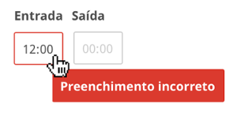

## 1. Regras

- O hint não deve possuir ponto final.
- Por padrão, o hint deve ser apresentado ao ter o hover no campo.
- Caso seja um hint de erro, o componente deve ser apresentado com borda vermelha, conforme figura abaixo

 _Exemplo de campo incorreto_

## 2. Mensagens

Aqui são descritas as mensagens apresentadas em forma de hint.

<h5 id="preenchimento-obg">Preenchimento obrigatório</h5>
    "Esse campo é de preenchimento obrigatório"

<h5 id="campo-invalido">Campo inválido</h5>
    "[nome do campo] informado(a) é inválido(a)"

<h5 id="campo-posterior">Campo posterior a outro campo</h5>
    “[nome do campo] deve ser posterior a [nome do campo]”

<h5 id="campo-anterior">Campo anterior a outro campo</h5>
    “[nome do campo] deve ser anterior a/ao [nome do campo]”

<h5 id="campo-menor-igual">Campo menor ou igual a outro campo</h5>
    “[nome do campo] deve ser menor ou igual a [nome do campo]”

<h5 id="intervalo-valido">Adicione intervalo válido</h5>
    “Adicione ao menos um intervalo válido.”

<h5 id="registro-existente-intervalo">Registro já existente no intervalo</h5>
    “Já existe um registro neste intervalo de horas.”

<h5 id="sem-horario-semanal">Sem horário semanal </h5>
    “Você não possui um horário semanal registrado para a data de hoje.”
